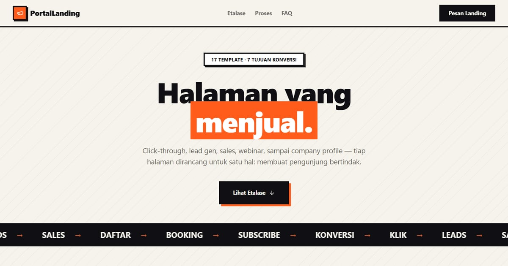

# PortalLanding — Halaman yang Menjual

PortalLanding: 17 landing page dengan tujuan berbeda — click-through, lead gen, sales, webinar, hingga company profile.

**Demo live:** https://portal-landing-seven.vercel.app



> Katalog demo milik PintuWeb. Setiap kartu menautkan ke demo live yang bisa dicoba.

## Konsep

"Halaman yang Menjual": katalog landing page dengan kartu billboard, bayangan oranye yang tegas, dan meteran konversi.

## Varian yang dipamerkan (17)

- [Bribu](https://landing-bribu.vercel.app) — Platform. Papan brief desain: tiga desainer dibayar untuk sketsa, klien memilih satu. 4 halaman; Pratinjau kartu brief.
- [Cissy Coffee](https://landing-cissycoffee.vercel.app) — Profil. Kedai kopi di Malang dengan papan menu kapur yang ditulis ulang tiap pagi. 5 halaman; Papan menu & kopi untuk acara.
- [CitaRasa Digital](https://landing-citarasa.vercel.app) — Lead Gen. Memindahkan rumah makan legendaris ke ponsel pelanggan, dengan studi kasus. 3 halaman; Tiga studi kasus.
- [EduPlay](https://landing-eduplay.vercel.app) — Click-Through. Aplikasi matematika SD kelas 1–3, sepuluh menit sehari. 3 halaman; Dua permainan bisa dimainkan.
- [Elevinar](https://landing-elevinar.vercel.app) — Webinar. Webinar yang dijalankan seperti pertunjukan, dengan denah kursi. 3 halaman; Buku acara siap cetak.
- [Lumicast](https://landing-lumicast.vercel.app) — Webinar. Siaran pelatihan untuk pengurus organisasi dengan rundown tercetak. 3 halaman; Cek perangkat interaktif.
- [LuxeElectro](https://landing-luxeelectro.vercel.app) — Sales. Toko audio dengan lembar spesifikasi lengkap dan uji dengar 14 hari. 3 halaman; Bandingkan kurva frekuensi.
- [Modewear](https://landing-modewear.vercel.app) — Sales. Pra-pesan kapsul pakaian kerja yang dijahit setelah dipesan. 4 halaman; Hitung mundur & pencari ukuran.
- [NextTalks](https://landing-nexttalks.vercel.app) — Webinar. Empat pembicara, satu meja, tiap Kamis kedua — plus arsip transkrip. 5 halaman; Arsip bisa dicari.
- [Nimbus](https://landing-nimbus.vercel.app) — Click-Through. Cloud lokal dengan halaman status 90 hari dan laporan insiden terbuka. 4 halaman; Kalkulator harga.
- [Rasa Nusantara](https://landing-rasanusantara.vercel.app) — Lead Gen. Kartu resep terstandar untuk dapur restoran — gramasi, titik kritis, HPP. 3 halaman; Penskala porsi 1–200.
- [SanzyHub](https://landing-sanzyhub.vercel.app) — Platform. Toko template landing page dengan dasbor katalog yang dihitung dari data. 3 halaman; Katalog bersaring & lisensi.
- [SkyWings](https://landing-skywings.vercel.app) — Produk. Maskapai antarkota dengan jadwal jam setempat dan papan keberangkatan. 7 halaman; Pencarian boarding pass.
- [Sribu (konsep redesain)](https://landing-sribu.vercel.app) — Platform. Konsep redesain tidak resmi: kontes desain sebagai sayembara, dengan catatan redesain. 2 halaman; Simulasi "Coba jadi juri".
- [Tasty Corner](https://landing-tastycorner.vercel.app) — Lead Gen. Struk Mingguan: satu menu F&B dibedah sampai rupiah terakhir. 4 halaman; Kalkulator food cost.
- [Woodora](https://landing-woodora.vercel.app) — Sales. Furnitur kayu solid sesuai ukuran, lengkap dengan gambar kerja. 4 halaman; Pratinjau ukuran langsung.
- [Zychrome](https://landing-zychrome.vercel.app) — Webinar. Webinar 95 menit dengan enam titik interaksi dan papan hasil. 3 halaman; Polling & kuis bisa dicoba.

## Halaman

`/`

## Teknologi

- Next.js 15.5 (App Router) dan React 19
- Tailwind CSS v4
- JavaScript
- Framer Motion, Lucide (ikon)
- Font: Syne, Inter (next/font)
- Tangkapan layar tiap varian diambil dari demo live (1 Okt 2026), `public/images/landing/`
- SEO: metadata per halaman, Open Graph, JSON-LD, sitemap.xml, dan robots.txt

## Menjalankan secara lokal

```bash
npm install
npm run dev
```

Buka http://localhost:3000. Untuk build produksi: `npm run build` lalu `npm start`.

---

Dibuat oleh [PintuWeb](https://pintuweb.com), jasa pembuatan website.
